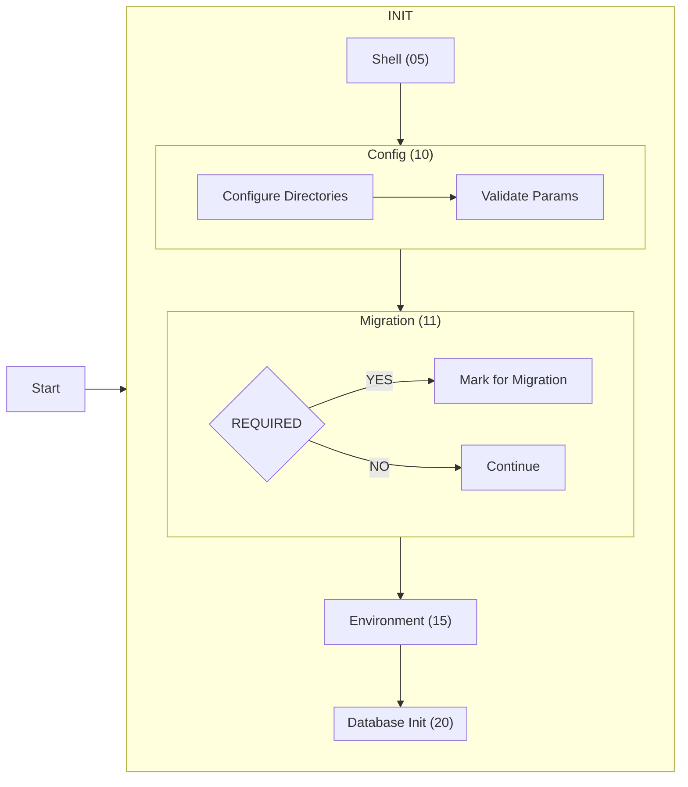

# Development

This part of the documentation holds internal information how the image works and
is used for development reference.

## Table of Contents

- [Global Workflow](#global-workflow)

## Global Workflow

